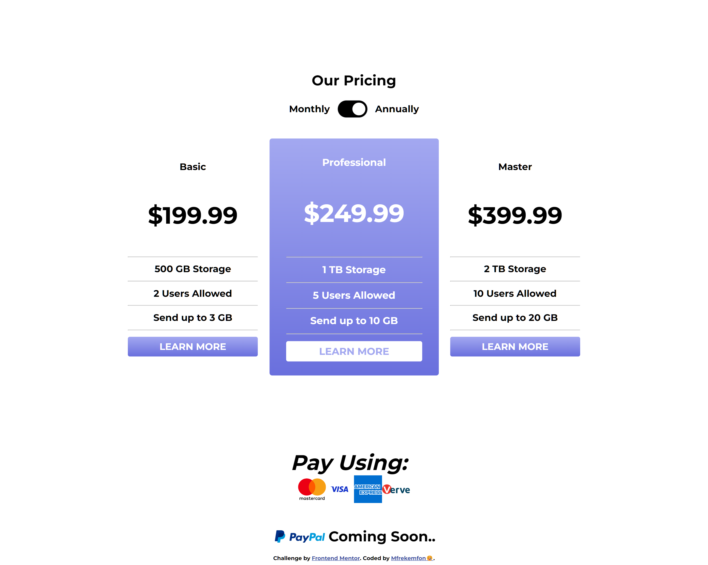

# Frontend Mentor - Pricing component with toggle solution

This is a solution to the [Pricing component with toggle challenge on Frontend Mentor](https://www.frontendmentor.io/challenges/pricing-component-with-toggle-8vPwRMIC). Frontend Mentor challenges help you improve your coding skills by building realistic projects. 

## Table of contents

- [Overview](#overview)
  - [The challenge](#the-challenge)
  - [Screenshot](#screenshot)
  - [Links](#links)
- [My process](#my-process)
  - [Built with](#built-with)
  - [What I learned](#what-i-learned)
  - [Useful resources](#useful-resources)
- [Author](#author)

## Overview

### The challenge

Users should be able to:

- View the optimal layout for the component depending on their device's screen size
- Control the toggle with both their mouse/trackpad and their keyboard

### Screenshot

### Links

- Solution URL: [Add solution URL here](https://your-solution-url.com)
- Live Site URL: https://radiant-rugelach-633291.netlify.app/

## My process

### Built with

- Semantic HTML5 markup
- JavaScript Functionalities
- CSS Flexbox

### What I learned

Working on this project, I learnt how to make toggle buttons, as well as the CSS 'transform:scale()' property. I also used more of Linear gradients in the slider and the 'learn more' buttons.

### Useful resources

- [Linear Gradients](https://www.w3schools.com/css/css3_gradients.asp) - This taught me how to move a linear gradient from thhe left to the right of an element.
- [Slider Toggle](https://www.w3schools.com/howto/howto_css_switch.asp) - This taught me how to create my slider toggle, and add colors to it as well during and after each click.

## Author

- Frontend Mentor - [@Mfrekee](https://www.frontendmentor.io/profile/Mfrekee)
- Twitter - [@acmfrekemfon](https://www.twitter.com/acmfrekemfon)
